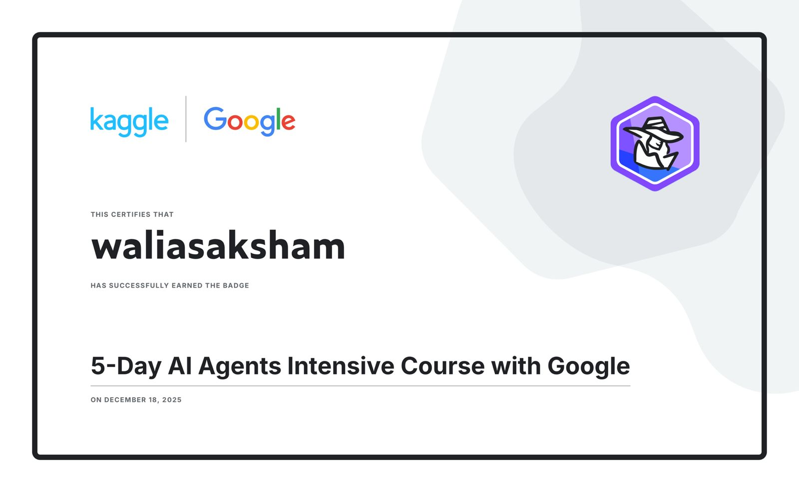

<div align="center">


<br /><br />

# 🎓 GrantFinder

### AI-Powered Travel Grant Discovery & Proposal Generator

*From hours of manual searching to a ready-to-submit proposal.*

[Overview](#-overview) · [Architecture](#-system-architecture) · [Setup](#️-setup) · [Usage](#️-run) · [Roadmap](#-future-improvements)

</div>

---

## 📌 Overview

**GrantFinder** is a multi-agent AI system that fully automates the academic travel funding pipeline. It discovers relevant grants, evaluates eligibility, ranks opportunities by fit, and generates a tailored, ready-to-submit proposal — all from a single researcher profile.

```
Search → Extract → Summarize → Score → Draft Proposal
```

Designed for students, researchers, and early-career academics who need funding but lack the time or resources to navigate the fragmented grant landscape.

---

## 🏫 Built During

<div align="center">

| | |
|---|---|
| **Program** | [5-Day Gen AI Intensive Course](https://rsvp.withgoogle.com/events/google-generative-ai-intensive) |
| **Organizers** | Kaggle × Google |
| **Focus** | AI Agents, multi-agent systems, LLM tooling |
| **Outcome** | GrantFinder — submitted as a capstone project |

This project was designed, built, and submitted as part of the **Kaggle × Google 5-Day AI Agents Intensive** — a structured, cohort-based program covering agent architectures, Gemini API integration, and real-world AI application development.

</div>

### 🎓 Certificate of Completion

> **Saksham Walia** — *5-Day Gen AI Intensive with Google*

<!-- To display your certificate: upload the image to your repo and replace the path below -->


> 💡 *To add your certificate: upload the image to this repo (e.g. `certificate.png`) and the badge above will render automatically on GitHub.*

---

## ⚡ The Problem

Finding academic travel funding is frustrating:

| Challenge | Impact |
|---|---|
| Grants scattered across hundreds of websites | Hours of manual searching |
| Eligibility criteria buried in dense HTML | Missed opportunities |
| Unstructured, inconsistent formatting | Hard to compare at a glance |
| Proposal writing is technical & time-consuming | Barrier to applying |

---

## 💡 The Solution

GrantFinder deploys a **4-agent pipeline** that handles every step automatically:

```
┌─────────────────────────────────────────────────────────┐
│                    GRANTFINDER PIPELINE                  │
│                                                         │
│  [Profile]──►[SearchAgent]──►[ExtractorAgent]           │
│                                     │                   │
│                              [SummarizerAgent]          │
│                                     │                   │
│                               [DraftAgent]──►[Proposal] │
└─────────────────────────────────────────────────────────┘
```

---

## 🧠 System Architecture

### 🔎 1. SearchAgent
- Generates intelligent, profile-aware search queries
- Scrapes results from Bing / DuckDuckGo
- Returns a ranked list of relevant grant URLs

### 📄 2. ExtractorAgent
- Fetches raw HTML from each grant page
- Extracts eligibility sections using targeted parsing
- Applies a noise-tolerant fallback for complex or broken pages

### 🧠 3. SummarizerAgent
- Sends content to **Google Gemini API** for intelligent summarization
- Scores each grant using a multi-factor relevance model:
  - ✅ Keyword overlap with researcher profile
  - ✅ Geographic eligibility
  - ✅ Conference / travel relevance
  - ✅ Funding range alignment
- Outputs a ranked JSON of best opportunities

### ✍️ 4. DraftAgent
- Generates a **complete, publication-ready grant proposal**
- Tailored to the specific grant, conference, and research topic
- Gracefully handles API quota limits with a structured fallback

---

## 🔄 Example Output

### 📌 Top Grant Identified
```
Grant:   Cornell Global Hubs Research Seed Grant
Score:   23.4
Status:  ✅ Eligible
```

### ✍️ Generated Proposal (Excerpt)
```
Title:   Advancing AI-Accelerated Materials Discovery for
         Carbon Capture and Utilization

Grant:   Global Hubs Research Seed Grant
Amount:  USD 2,000

Objective:
  To present cutting-edge research at an international conference
  and contribute to global decarbonization efforts through
  AI-driven materials science.

[Full proposal saved to proposal_draft.txt]
```

---

## 🧪 Tech Stack

| Component | Technology |
|---|---|
| Language | Python 3.9+ |
| AI / LLM | Google Gemini API |
| Web Scraping | BeautifulSoup4, Requests |
| Progress Tracking | tqdm |
| Notebook Environment | Kaggle / Jupyter |
| Output Formats | `.txt`, `.json` |

---

## ✅ Features

- 🤖 **Multi-agent architecture** — modular, extensible agents with single responsibilities
- 🔍 **Real-time grant discovery** — live web search on every run
- 📋 **Eligibility extraction** — parses raw HTML to surface what matters
- 📊 **Intelligent scoring** — multi-factor relevance ranking
- ✍️ **Automated proposal writing** — LLM-generated, context-aware drafts
- 🔁 **API quota-safe fallback** — graceful degradation when limits are hit
- 🧾 **Structured outputs** — clean JSON summaries and plain-text proposals
- 🔍 **Agent observability** — logs and memory bank for every run

---

## 🧠 AI Concepts Applied

| Concept | Implementation |
|---|---|
| Multi-agent systems | 4 specialized agents with defined roles |
| Sequential workflows | Ordered pipeline with state passing |
| LLM-powered reasoning | Gemini for summarization & proposal drafting |
| Custom tools | Purpose-built scrapers and scoring functions |
| Context engineering | Profile-aware prompting across agents |
| Fallback handling | Quota-safe degradation for long-running tasks |
| Observability | Memory bank, scoring logs, run traces |

---

## 🌍 Who Is This For?

GrantFinder is built for anyone who needs travel funding but lacks the time or support infrastructure to find it:

| Audience | Use Case |
|---|---|
| 🎓 Graduate students | Conference travel funding |
| 🧑‍🔬 Early-career researchers | First international presentation |
| 🌱 Innovators from developing regions | Access to global academic networks |
| 👩‍🏫 Faculty with limited departmental support | Supplemental travel grants |

---

## 📂 Project Structure

```
GrantFinder/
│
├── grantfinder.ipynb      # Main multi-agent notebook
├── proposal_draft.txt     # ✍️ Generated grant proposal
├── grant_summary.json     # 📊 Ranked grant opportunities
├── memory_bank.json       # 🧾 Agent memory & run logs
├── certificate.png        # 🎓 Kaggle × Google course certificate
└── README.md              # 📖 This file
```

---

## ⚙️ Setup

### 1. Install Dependencies

```bash
pip install requests beautifulsoup4 tqdm google-generativeai
```

### 2. Configure API Key

```bash
# Option A: Environment variable (recommended)
export GOOGLE_API_KEY=your_api_key_here

# Option B: Inline in notebook
GOOGLE_API_KEY = "your_api_key_here"
```

> 🔐 Never commit your API key to version control. Use `.env` files or secrets management in production.

---

## ▶️ Run

```python
# Step 1: Define your researcher profile
profile = {
    "name": "Your Name",
    "field": "Materials Science / AI",
    "conference": "NeurIPS 2025",
    "location": "India",
    "funding_needed": 2000
}

# Step 2: Run the full pipeline
urls    = search_agent.run(profile)
data    = extractor_agent.run(urls)
grants  = summarizer_agent.run(data)
draft   = draft_agent.run(grants[0])        # Top-ranked grant
```

---

## 📈 Impact

<div align="center">

| Metric | Manual Process | GrantFinder |
|---|---|---|
| ⏱️ Time to find grants | 3–5 hours | < 1 minute |
| 📄 Proposal drafting | 2–4 hours | Automated |
| 🎯 Grant relevance | Variable | AI-scored |
| 🌍 Coverage | Limited | Web-wide |

</div>

---

## 🔮 Future Improvements

- [ ] 🔍 Google Custom Search API integration
- [ ] 📄 PDF proposal export (formatted)
- [ ] 📧 Automated email submission
- [ ] 🔔 Grant deadline alerts & notifications
- [ ] 🖥️ Web UI / dashboard
- [ ] 🌐 Multilingual proposal support
- [ ] 🗃️ Grant database with historical data

---

## 🏆 Track

> **🟩 Agents for Good**
> Helping researchers and students worldwide access funding and global academic exposure through intelligent automation.

---

## 👨‍💻 Author

**Saksham Walia**
University of Wollongong India

[](https://github.com/walia-004)
[](https://www.linkedin.com/in/walia-saksham)

---

<div align="center">

### ⭐ If GrantFinder helped you, consider giving it a star!

*GrantFinder demonstrates how multi-agent AI systems can solve real academic challenges — automating discovery, analysis, and content generation to make global opportunities more accessible for everyone.*

</div>
